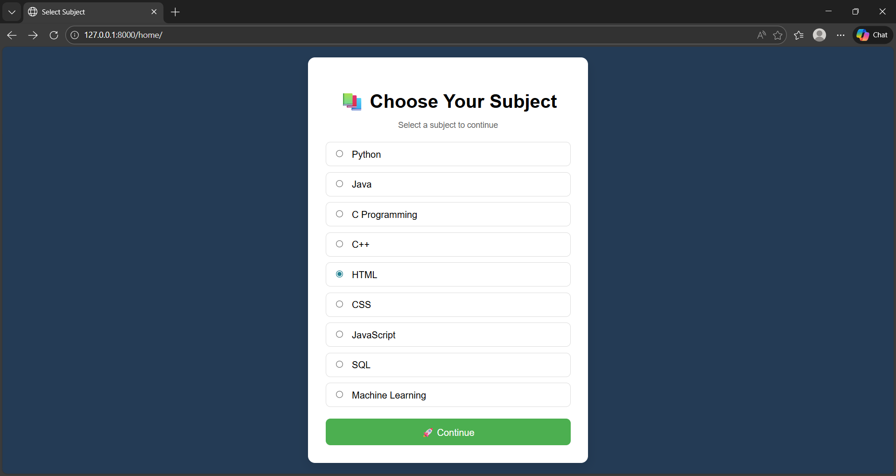
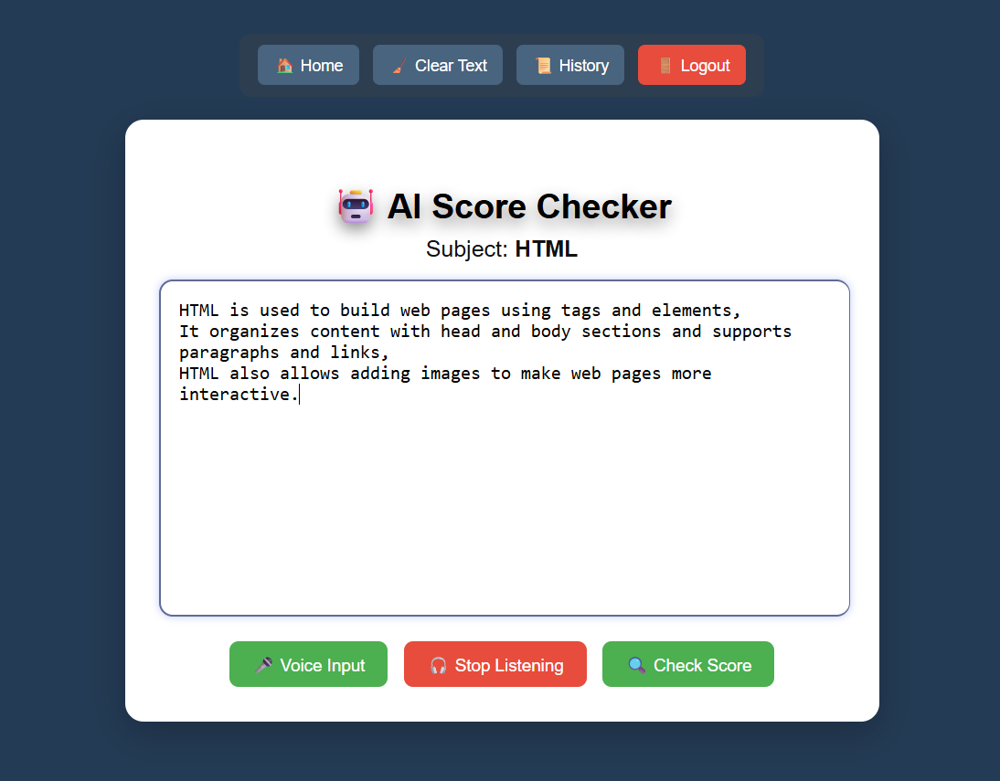
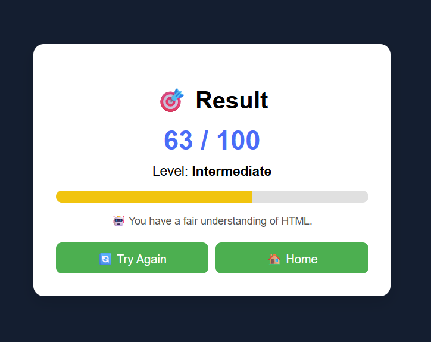

# AI Score Checker

# Project Overview
AI Score Checker is a web-based application developed using Django. 
The system analyzes user input data and calculates a score based on predefined logic or AI-based evaluation rules.

# Features
- User input form
- Score calculation logic
- Data storage using SQLite
- Clean web interface
- Admin panel access

# Technologies Used
- Python
- Django
- SQLite
- HTML
- CSS

# Requirements
- Python 3.x
- Django

Install dependencies:
pip install -r requirements.txt

# How to Run the Project

1. Download the project (Code → Download ZIP).
2. Extract the ZIP file.
3. Open Command Prompt inside the project folder.
4. Install required libraries:
   pip install -r requirements.txt
5. Apply migrations:
   python manage.py migrate
6. Run the server:
   python manage.py runserver
7. Open browser and visit:
   http://127.0.0.1:8000/

#Screenshots
(Add your screenshots inside a screenshots folder)

# Developed by
S.Aparanjani
